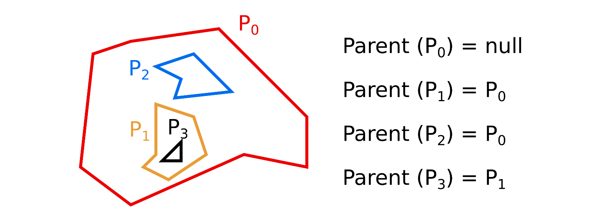

# Polygon nesting for simple polygons

This is a generic, header-only implementation of the algorithm of Bajaj and Dey which efficiently computes the nesting structure of a set of *m* simple, planar polygons which are mutually non-intersecting.

The nesting structure is a directed acyclic graph (a forest of trees) where the *ancestors* of a polygon *P* are the polygons that contain *P* and the *parent* of a polygon *Pi* is either *null* if *ancestors(Pi)* is the empty set (i.e., *Pi* is not nested within another polygon) or the polygon *Pj* so that *ancestors(Pj)* = *ancestors(Pi) - Pj*. 

For set of *m* simple polygons with *n* vertices and *N* notches (i.e., reflex vertices), the algorithm computes the nesting structure in *O(n + (m+N)log(m+N))* time, which runs faster than an *O(n log n)* algorithm.

For details regarding the runtime or the algorithm itself, please refer to the original paper:

Chandrajit L. Bajaj, Tamal K. Dey: Polygon Nesting and Robustness. Information Processing Letters 35(1): 23-32 (1990)

You can find the technical report in which the algorithm was originally proposed here: [https://docs.lib.purdue.edu/cgi/viewcontent.cgi?article=1781&context=cstech].

The implementation supports both clockwise and counter-clockwise vertex order for polygons, but you need to provide a functor to retrieve the orientation for a polygon that is added to the set. Here is an example illustrating an input configuration and the computed result (i.e., the parent of each polygon). This corresponds to configuration 4 in `test.cpp`:

For details on how to use the implementation, please refer to the class documentation in `polygonnesting.h` and the examples in `test.cpp`. You will need to compile with C++ 11 support. The implementation has been compiled and tested using GCC 7.4 on Linux Mint 19, clang 10.0.1 on Mac OS, and Visual Studio 2017 on Windows 7.
